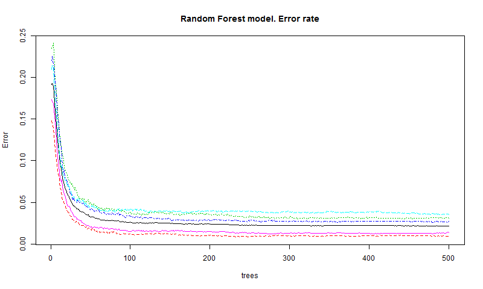
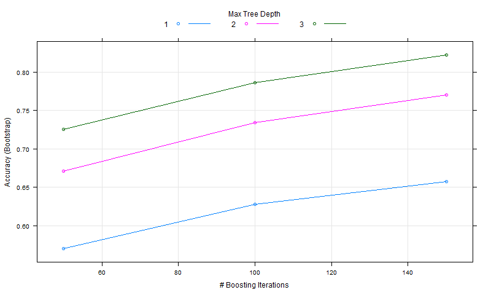

```{r setup, include=FALSE}
knitr::opts_chunk$set(echo = TRUE)
knitr::opts_chunk$set(cache = TRUE)

require(caret);require(knitr)
require(ggplot2);require(ipred)
require(randomForest);require(e1071);
require(gbm);require(survival);require(foreach)

```

# Summary

This paper describes the application of the machine learning algorithms and methods to predict human activity, using measurements from the wearable devices such as smartphones, smartwatches, activity trackers and so on. 
The study has been done with HAR dataset, collected by the group of the researchers (please check the project page here [http://groupware.les.inf.puc-rio.br/har](http://groupware.les.inf.puc-rio.br/har).
The main goal of this work, gain practical knowledge in the machine learning area and build a model which could identify human activity using data from the wearable devices. 
The final prediction model is built on the Parallel Random Forest algorithm and shows accuracy rate as **0.896** on pre-processed test data set.    

# Source Data
Fo train and test prediction models we will use two data sets, generously provided by the HAR project contributors. 
Training dataset could be found at [https://d396qusza40orc.cloudfront.net/predmachlearn/pml-training.csv](https://d396qusza40orc.cloudfront.net/predmachlearn/pml-training.csv).
Testing data are located [https://d396qusza40orc.cloudfront.net/predmachlearn/pml-testing.csv](https://d396qusza40orc.cloudfront.net/predmachlearn/pml-testing.csv).

```{r }
# Cached file names
trnFile="./dataCache/pml-training.csv";
tstFile="./dataCache/pml-testing.csv";
# check if files are  available
if (!file.exists(trnFile)) 
   download.file("https://d396qusza40orc.cloudfront.net/predmachlearn/pml-training.csv",trnFile,method="auto");
if (!file.exists(tstFile)) 
     download.file("https://d396qusza40orc.cloudfront.net/predmachlearn/pml-testing.csv",tstFile,method="auto");
```
Let's take a look into the source file. 

"19621","adelmo",1322832937,964299,"02/12/2011 13:35","no",864,143,-35.9,131,18,"","","","","","",NA,NA,"",NA,NA,"",NA,NA,"",NA,NA,NA,NA,NA,NA,NA,NA,NA,NA,0.37,.....,"E"
"19622","adelmo",1322832937,972293,"02/12/2011 13:35","yes",864,143,-36,132,18,"-1.175902","-1.063259","#DIV/0!","0.196860",......,"E"

As you may see, there are plenty non-numeric values, like *NA* or *#DIV/0!*, those values may turn variable from the linear predictor to the classification. Function read.csv allows you specify how to properly handle missing values.
```{r getData}
# Load testing and training data sets.
training<- read.csv(trnFile,header = TRUE, na.strings = c("NA","NaN","#DIV/0!"));
testing <- read.csv(trnFile,header =TRUE, na.strings = c("NA","NaN","#DIV/0!"));
```
# Preprocess  data
We will use _training_ data for preparation and mode training, while  _testing_  data set will be used only for the model verification. Let's take a look to the dataset and structure of the training data. 
```{r dataObservation}
# Ensure reproducible results.
set.seed(70720791)
dim(training);
str(training,list.len=10)
```
We have target classifier and 159 variables. After a closer look, you may find that not all of them are good enough for the model. For example, variable  *X* is nothing like a row number and would give us unwanted prediction noise. We are going to predict activity using device measurements, so I have excluded all the date/time variables, as soon as they will be tightly correlated to the measurements. We lay down most of the night, didn't we? The same is true for the user names. Potentially, there could be strong and unwanted correlations,  because users may have different devices with the different measurements. 

```{r NaRate}
 #Remove row numbers and misleading variables
 tr<-subset(training,select=-c(1:7))
 tt<-subset(testing,select=-c(1:7))
 kable(as.data.frame(sapply(levels(training$classe),function(X){table(is.na(training[training$classe == X,]))})))
```

The table above is a rough ballpark to demonstrate, that good half of the data has no data. Because most of the prediction algorithms are  intolerant to the missing values, I have prepared the training set  as below:

1. Drop zero or constant variables   
```{r NZV}
ztr<-nearZeroVar(tr,saveMetrics = TRUE)
head(ztr[ztr$zeroVar+ztr$nzv>0,])
# If cached object exists load it
if (file.exists("dataCache/zt.rds")) {
  zt<-readRDS("dataCache/zt.rds")
} else {
  zt<-nearZeroVar(tr);
  saveRDS(zt,file="dataCache/zt.rds")
}
tr <-tr[,-zt]
tt <-tt[,-zt]
``` 

2. Preprocess data to impute missing values and perform principal component analysis.
```{r PCA}
# Check cached pre process object
if (file.exists("dataCache/ppr.rds")) {
  ppr<-readRDS("dataCache/ppr.rds")
} else {
  ppr<-preProcess(tr[,-160],method=c("bagImpute","center","pca"));
  saveRDS(ppr,file="dataCache/ppr.rds");
}
#Preprocess results
ppr
## Prepre data for prediction
trp<-predict(ppr,tr)
## Prepare data for testing
tsp<-predict(ppr,tt)
dim(trp)
```

#Build prediction models
Now we are ready to build prediction models. Our target variable is a classifier, so I will use only classification models: 
* Random Forest (it's parallel implementation)
* Gradient Boosted Models

Training models even with the prepared data set are quite time-consuming and the code below trains models only in case if there are no file cache available, otherwise it reads cached models from the RDS format. 

```{r randomForest}
# Cached model files
rfFile="./dataCache/rfFit.rds";
gbFile="./dataCache/gbmFit.rds";
# Preparing RandomForestModel 
if (file.exists(rfFile)) {
   rfFit<-readRDS(rfFile);
} else {
# Fitting parallel Random Forset model
 rfParam<-expand.grid(mtry=round(sqrt(ncol(trp))))
 rfFit<-train(classe ~ .,trp,method="parRF",tuneGrid=rfParam) 
 saveRDS(rfFit,rfFile)
}
  
if (file.exists(gbFile)) {
  gbmFit<-readRDS(gbFile);
} else {
# compute  GBM model
  gbmFit<-train(classe ~ ., trp,method="gbm", trace=FALSE);
}
```

## Random Forest accuracy
The random forest model fits training data set with the accuracy as below:
```{r rfAcc}
   rfFit
```

You may see the model error rate dependency on the plot below:
#```{r rfErrorRates,dpi=100,figure.width=10,figure.height=10,out.width='800px',out.height='800px'}
```{r rfErroRates}
 png("figures/rfm-plot1.png",width = 800,height = 480) 
 plot(rfFit$finalModel,main="Random Forest model. Error rate")
 dev.off()
```



## Gradient Boosted Model
Accuracy for the GBM model is slightly worse than for the random forests:
```{r gbAcc}
   gbmFit
```
You may see the model accuracy over the iteartions and tgree depths   on the diagram below:
#```{r gbmModel,dpi=100,figure.width=10,figure.height=10,out.width='800px',out.height='800px'}
```{r plotGBMModel}
 png("figures/gbm-plot1.png",width = 800,height = 480) 
 plot(gbmFit)
 dev.off()
```



Let's check combined model accuracy for the training data set:
```{r combAcc}
sum(predict(rfFit) == predict(gbmFit))/nrow(trp)
```
It's better than GBM model but worse than random forest. However, 97% of accuracy may be a slightly overfitted. Let's run the models on the testing data set and see results.

#Validate models
To estimate model accuracy, I use testing dataset, prepared the same way as the training one.
```{r predict data}
  rfTest<-predict(rfFit,newdata=tsp)
  gbTest<-predict(gbmFit,newdata = tsp)
```

Prediction accuracy for the Random Forest model are:
```{r COnfMatrixRF}
   confusionMatrix(rfTest,tsp$classe)
```
Confusion matrix indicates, that accuracy ratio went down on test data and gets closer to the GBM model results.
While GBM model shows about the same accuracy rate as for the training  data:
```{r confMatrixGBM}
   confusionMatrix(gbTest,tsp$classe)
```
Let's doubl check accuracy rate for the results where both models are agree on the outcome:

```{r combAccTest}
sum(rfTest == gbTest)/length(rfTest)
```

#Conclusion
Results above shows that both models show about the same accuracy for the test data, while the random forest algorithm is slightly better than GBM. The accuracy of agreed values is worse than it was for the training data and felt below GBM prediction.
Further model improvement, may require more detailed subject matter study and review predictors from the source datasets. 

#References
1. Jeff Leek, Ph.D.  Coursera, Practical Machine Learning, 2017.
URL:[https://www.coursera.org/learn/practical-machine-learning](https://www.coursera.org/learn/practical-machine-learning)
2. Lenwood (nickname). Parallel Random Forset tuning, 2014,
URL: [http://stackoverflow.com/questions/23607454/how-to-use-parrf-method-so-random-forest-will-run-faster](http://stackoverflow.com/questions/23607454/how-to-use-parrf-method-so-random-forest-will-run-faster)  
3. Max Kuhn, R Documentation. preProcess predictors. 
URL [https://www.rdocumentation.org/packages/caret/versions/3.21/topics/preProcess](https://www.rdocumentation.org/packages/caret/versions/3.21/topics/preProcess)

